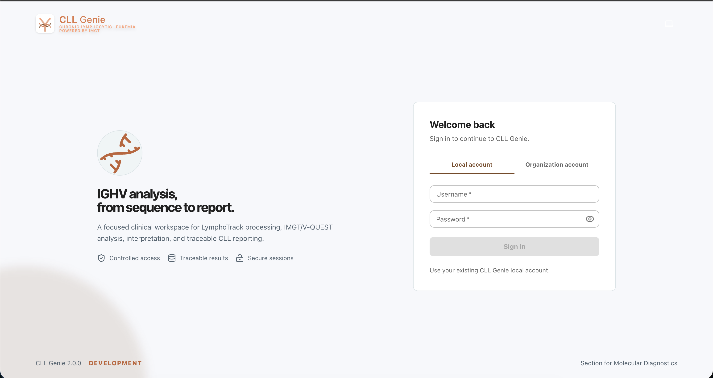

<div align="center">
  
  <h1>CLL Genie 2.0</h1>
  <p><em>Advanced Clinical Genomics Pipeline for Chronic Lymphocytic Leukemia</em></p>

### Platform


### Domain and Governance


</div>

---

## Overview

`cll_genie` is a modern, web-based application providing a streamlined workflow for processing sequencing data and generating clinical reports. The application is designed to track samples, automate the secondary stage of analysis for LymphoTrack Dx outputs, and dynamically produce clinical PDF reports.

Built with scalability, accuracy, and usability in mind, this platform is tailored to the needs of clinical geneticists, doctors, developers, and administrators involved in Chronic Lymphocytic Leukemia (CLL) research and diagnostics.

## Features

- **Sample Tracking & Ingestion:** Automated ingestion of sequencing runs and auto-attachment of LymphoTrack Dx results and QC metrics.
- **IMGT/V-QUEST Integration:** Automated secondary analysis that sends data to the IMGT/V-QUEST server and retrieves/parses the results.
- **Rules Engine:** Dynamic clinical interpretations for V-gene mutation status and subset information based on customizable rules.
- **Reporting:** Generate immutable, signed clinical PDF reports containing both the automated interpretation and clinical comments.
- **Security & RBAC:** Role-Based Access Control and authentication for User and Admin privileges.
- **Dockerized Architecture:** Highly scalable backend (FastAPI, Celery, MongoDB, Redis) and a modern frontend (React, Vite).

## Workflow

1. **Sequencing, Demultiplexing, and QC**  
   Prepare raw sequencing data by performing sequencing, demultiplexing, and quality control. The samples are then registered automatically or manually in the `cll_genie` database.
2. **Run LymphoTrack Dx Software**  
   Process FASTQ files using LymphoTrack Dx to generate first-stage results. This outputs an Excel file with sequence metrics and a text file with QC metrics. These results are attached to the samples.
3. **cll_genie Analysis**  
   The sample is analyzed within `cll_genie`. Sequences are parsed, filtered, and sent to the IMGT/V-QUEST server. The secondary analysis results, along with CLL subset information, are displayed in the application.
4. **Clinical Reporting**  
   Clinicians review the interpretations, add qualitative comments, and generate a final PDF report for diagnostic casework.

## Important Links & Endpoints

When running the application locally via Docker Compose, the following URLs are available:

- **Web UI:** [http://localhost:8080/cll_genie/](http://localhost:8080/cll_genie/)
- **API Swagger Docs:** [http://localhost:8080/cll_genie/api/v1/docs](http://localhost:8080/cll_genie/api/v1/docs)
- **API OpenAPI JSON:** [http://localhost:8080/cll_genie/api/v1/openapi.json](http://localhost:8080/cll_genie/api/v1/openapi.json)
- **Health Check (Live):** [http://localhost:8080/cll_genie/health/live](http://localhost:8080/cll_genie/health/live)
- **Health Check (Ready):** [http://localhost:8080/cll_genie/health/ready](http://localhost:8080/cll_genie/health/ready)

## Documentation

The documentation is modularized and designed to be read as a flow from start to finish.

**Start here: [docs/index.md](docs/index.md)**

**📖 [Read the CLL Genie Master Guide](docs/index.md)**

<div align="center">
  
</div>

## Quick Start (Docker Compose)

The entire application runs via Docker Compose.

```bash
# Clone the repository
git clone https://github.com/your-org/cll_genie.git
cd cll_genie

# Configure IMGT credentials
cp .env.example .env
nano .env # Set IMGT_USER and IMGT_PASSWORD

# Build and launch
docker compose up --build
```

Access the UI at `http://localhost:8080/cll_genie/`.

> [!TIP]
> **First-time Login:** Default user is `admin` / `admin`. Be sure to change the password immediately.

## Who Built It?

CLL Genie is developed and maintained by the bioinformaticians at the Section for Molecular Diagnostics (SMD), Lund, in close collaboration with clinical geneticists. The system is in active use for diagnostics casework, variant interpretation, and report creation.

## Contact & Support

For inquiries, feedback, or deployment support, please contact the SMD development team at Lund.
**Email:** ram.nanduri@skane.se  
**GitHub Issues:** [cll_genie/issues](https://github.com/ramsainanduri/cll_genie/issues)

## License

© 2026 Section for Molecular Diagnostics (SMD), Lund. All rights reserved. Internal use only.
