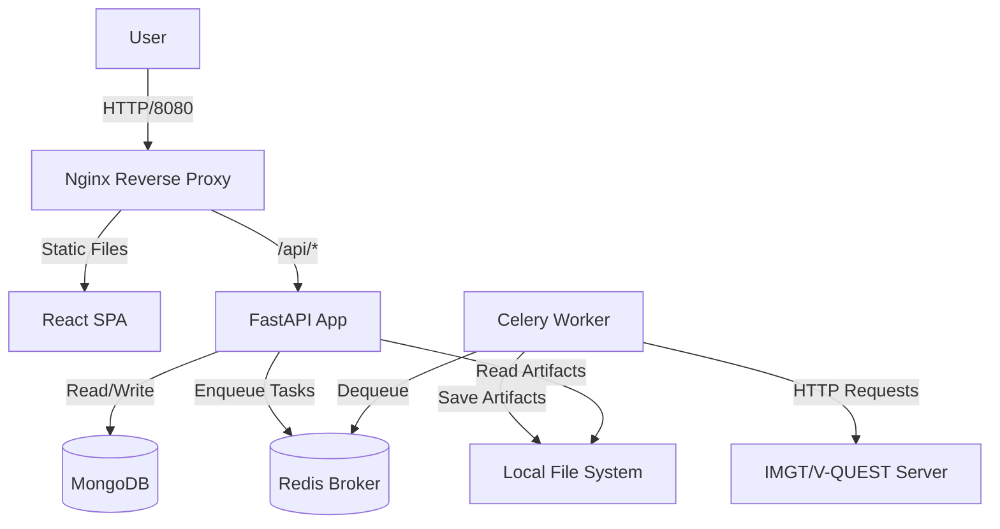

# 2. Installation and Developer Setup

CLL Genie application services run in containers. MongoDB may run as an optional Compose service, as a host-installed service, or on another reachable server. Select the topology that matches the development or deployment environment.

## Prerequisites

- [Docker Engine](https://docs.docker.com/engine/install/).
- [Docker Compose](https://docs.docker.com/compose/install/), either the `docker compose` plugin or the legacy `docker-compose` command.
- A MongoDB endpoint reachable from the API, worker, and scheduler containers. The optional Compose profile provides MongoDB 3.4 for development.

The examples use the Docker Compose v2 spelling, `docker compose`. With Compose 1.29, replace it with `docker-compose`. Development commands load `compose.yaml`, `compose.dev.yaml`, and `.env.dev`; base or production commands load `compose.yaml` and `.env`.

## Environment Variables

For development, copy `.env.example` to `.env.dev` in the repository root and review every value.

```bash
cp .env.example .env.dev
```

### Selecting a development MongoDB topology

`MONGODB_URI` is read from the selected environment file. It must identify an address reachable **from the application containers**. The value is not hardcoded to the Compose MongoDB service.

#### Option A: MongoDB provided by Compose

Use the Compose service name and enable the `mongo` profile:

```dotenv
MONGODB_URI=mongodb://mongo:27017
```

```bash
docker compose --env-file .env.dev \
  -f compose.yaml -f compose.dev.yaml \
  --profile mongo up -d --build
```

`MONGO_DEV_PORT` publishes this optional container to the host for database clients and administrative tools. It does not change the container-side address `mongo:27017`.

#### Option B: MongoDB installed on the Docker host

Do not enable the `mongo` profile. Configure the URI with a host address reachable from Docker containers:

```dotenv
MONGODB_URI=mongodb://172.17.0.1:27017
```

`172.17.0.1` is a common Linux Docker bridge gateway, but it is not universal. Confirm the gateway for the active Docker network and ensure MongoDB listens on that interface. Host firewall rules must permit connections from the Docker network. `localhost` and `127.0.0.1` inside a container refer to that container, not the Docker host.

Start development without the MongoDB profile:

```bash
docker compose --env-file .env.dev \
  -f compose.yaml -f compose.dev.yaml \
  up -d --build
```

#### Option C: MongoDB on another server

Set `MONGODB_URI` to the server DNS name or IP address, including credentials, replica-set parameters, and TLS options when required. The endpoint must be reachable from the API, worker, and scheduler containers.

#### Verifying the configured connection

The following command tests the same `MONGODB_URI` and database client used by the application. It works with all three topologies:

```bash
docker compose --env-file .env.dev \
  -f compose.yaml -f compose.dev.yaml \
  exec api python -c \
  'from cll_genie_api.infrastructure.mongo import get_collections; get_collections().ping(); print("MongoDB connection successful")'
```

The Worklist system-status panel performs the same configured-client ping. It does not assume that MongoDB runs in Docker.

### Application and Compose

| Variable             | Example             | Purpose                                                                                                                                                            |
| -------------------- | ------------------- | ------------------------------------------------------------------------------------------------------------------------------------------------------------------ |
| `APP_NAME`           | `CLL Genie`         | Application title exposed in API metadata.                                                                                                                         |
| `ENVIRONMENT`        | `development`       | Runtime mode: `development`, `test`, `validation`, or `production`. Production disables the interactive API documentation and enables production logging behavior. |
| `APPLICATION_PREFIX` | `/cll_genie`        | URL prefix used by health endpoints and the session cookie path.                                                                                                   |
| `API_PREFIX`         | `/cll_genie/api/v1` | URL prefix applied to the versioned API routes and API documentation.                                                                                              |
| `CLL_GENIE_PORT`     | `8080`              | Host port mapped to the Nginx proxy. The UI is served from this port.                                                                                              |
| `MONGO_DEV_PORT`     | `27017`             | Host port published by the optional Compose MongoDB service. It is unused when MongoDB runs outside Compose.                                                       |
| `APP_UID`            | `10001`             | Numeric user ID used by the API, worker, and scheduler containers. Use `id -u`; do not enter a username.                                                            |
| `APP_GID`            | `10001`             | Numeric group ID used by the API, worker, and scheduler containers. Use `id -g`; do not enter a group name.                                                         |

The application version is defined once in `backend/src/cll_genie_api/version.py`. Python package metadata, API metadata, health responses, reports, and the frontend build all read that file. The version is not an environment setting.

### Container resource limits

Every container has a Compose-controlled hard CPU and memory ceiling. CPU values represent CPU cores and may be fractional. Memory values use Docker units such as `128M`, `1G`, or `2G`.

| Variable                                         | Development default | Container                                 |
| ------------------------------------------------ | ------------------: | ----------------------------------------- |
| `PROXY_CPU_LIMIT` / `PROXY_MEMORY_LIMIT`         |     `0.25` / `128M` | Nginx reverse proxy                       |
| `FRONTEND_CPU_LIMIT` / `FRONTEND_MEMORY_LIMIT`   |     `1.00` / `768M` | Vite development server; development only |
| `API_CPU_LIMIT` / `API_MEMORY_LIMIT`             |       `1.00` / `1G` | FastAPI application                       |
| `WORKER_CPU_LIMIT` / `WORKER_MEMORY_LIMIT`       |       `2.00` / `2G` | Celery ingestion and IMGT worker          |
| `SCHEDULER_CPU_LIMIT` / `SCHEDULER_MEMORY_LIMIT` |     `0.25` / `256M` | Celery Beat scheduler                     |
| `REDIS_CPU_LIMIT` / `REDIS_MEMORY_LIMIT`         |     `0.50` / `512M` | Redis broker/result backend               |
| `MONGO_CPU_LIMIT` / `MONGO_MEMORY_LIMIT`         |       `1.00` / `1G` | Optional development MongoDB 3.4          |

These are upper limits, not reservations. A container may use less. When it reaches its CPU ceiling, Docker throttles it. When it exceeds its memory ceiling, the process may be terminated as out-of-memory, so production limits must be sized from observed workload. The worker needs the largest allowance because workbook parsing, IMGT ZIP parsing, report preparation, and concurrent Celery processes can overlap.

These values are Compose settings, not Python application settings. They are kept in the environment file because Docker applies them before the Python process starts. The production `.env` may use different limits from `.env.dev` without changing Compose YAML.

Inspect live consumption and configured ceilings with:

```bash
docker stats

docker inspect cll-genie-worker --format \
  'memory={{.HostConfig.Memory}} bytes nano_cpus={{.HostConfig.NanoCpus}}'
```

### Databases and Celery

| Variable               | Example                                  | Purpose                                                                                                                                            |
| ---------------------- | ---------------------------------------- | -------------------------------------------------------------------------------------------------------------------------------------------------- |
| `MONGODB_URI`          | `mongodb://mongo.example.internal:27017` | MongoDB connection URI used by the API, worker, and scheduler. It may reference the Compose service, the Docker host, or another reachable server. |
| `APPLICATION_DATABASE` | `cll_genie`                              | MongoDB database containing users, sessions, application data, and analysis data.                                                                  |
| `REDIS_URL`            | `redis://redis:6379/0`                   | Redis URL used as both the Celery broker and result backend.                                                                                       |
| `CELERY_EAGER`         | `false`                                  | When `true`, executes Celery tasks synchronously in the calling process. Intended for tests, not normal deployments.                               |

Collection names are stable Python defaults and are normally not listed in `.env`. They remain overrideable for migrations or coexistence with legacy data:

| Optional override       | Default                  | Collection contents                                                                                     |
| ----------------------- | ------------------------ | ------------------------------------------------------------------------------------------------------- |
| `USERS_COLLECTION`      | `users`                  | Local user profiles, roles, login methods, optional local password hashes, and `last_login`.             |
| `SESSIONS_COLLECTION`   | `cll_genie_sessions`     | Active login sessions and expiry timestamps.                                                            |
| `SAMPLES_COLLECTION`    | `samples`                | Registered sequencing samples and LymphoTrack QC metadata.                                              |
| `RESULTS_COLLECTION`    | `vquest_results`         | IMGT/V-QUEST submissions, parsed results, ZIP metadata, and comments.                                   |
| `JOBS_COLLECTION`       | `analysis_jobs`          | Asynchronous analysis-job status, progress, and worker messages.                                        |
| `COUNTERS_COLLECTION`   | `submission_counters`    | Sequential submission counters per sample.                                                              |
| `ARTIFACTS_COLLECTION`  | `artifacts`              | Metadata for uploaded workbooks, QC files, generated reports, and analysis artifacts.                    |
| `REPORTS_COLLECTION`    | `reports`                | Generated clinical report records and visibility state.                                                 |
| `RULES_COLLECTION`      | `report_rules`           | Clinical report interpretation rules.                                                                   |
| `AUDIT_EVENTS_COLLECTION` | `audit_events`         | Security and business audit events.                                                                     |

### Authentication and sessions

| Variable              | Example             | Purpose                                                                                                                                 |
| --------------------- | ------------------- | --------------------------------------------------------------------------------------------------------------------------------------- |
| `AUTH_PROVIDERS`      | `ldap,local`        | Comma-separated enabled login providers. Supported values are `ldap` and `local`; Organization/LDAP is presented first when configured. |
| `SESSION_COOKIE_NAME` | `cll_genie_session` | Name of the browser cookie containing the session token.                                                                                |
| `SESSION_TTL_SECONDS` | `28800`             | Session lifetime in seconds; `28800` is eight hours.                                                                                    |
| `COOKIE_SECURE`       | `false`             | Set to `true` when the application is served over HTTPS so browsers only send the session cookie over secure connections.               |
| `COOKIE_SAMESITE`     | `lax`               | Browser SameSite policy for the session cookie. Supported values are `lax` and `strict`.                                                |

### LDAP

LDAP settings are used only when `ldap` is present in `AUTH_PROVIDERS`.

| Variable                       | Example                                     | Purpose                                                                                                                                                                        |
| ------------------------------ | ------------------------------------------- | ------------------------------------------------------------------------------------------------------------------------------------------------------------------------------ |
| `LDAP_HOST`                    | `ldap://ldap.example.internal`              | LDAP server URI. Use `ldap://` with STARTTLS or `ldaps://` with SSL.                                                                                                           |
| `LDAP_BASE_DN`                 | `dc=example,dc=internal`                    | Directory base DN. It is combined with `LDAP_USER_DN` for user searches.                                                                                                       |
| `LDAP_USER_LOGIN_ATTR`         | `mail`                                      | LDAP attribute matched against the login identifier. With `mail`, CLL Genie uses the email stored in the local user record.                                                    |
| `LDAP_USE_SSL`                 | `false`                                     | Enables implicit TLS (LDAPS). When `true`, use an `ldaps://` host and set `LDAP_USE_TLS=false`.                                                                                |
| `LDAP_USE_TLS`                 | `true`                                      | Enables STARTTLS before binding. When `true`, use an `ldap://` host and set `LDAP_USE_SSL=false`.                                                                              |
| `LDAP_TLS_VALIDATE`            | `true`                                      | Validates the LDAP server certificate against the container trust store. Keep enabled in production. Development may set `false` only for an internal self-signed certificate. |
| `LDAP_BINDDN`                  | `cn=service-account,dc=example,dc=internal` | Service-account distinguished name used to search for users.                                                                                                                   |
| `LDAP_SECRET`                  | `replace-me`                                | Service-account password. Replace this value and never commit the populated `.env` file.                                                                                       |
| `LDAP_USER_DN`                 | `ou=people`                                 | User subtree relative to `LDAP_BASE_DN`; the example searches `ou=people,dc=example,dc=internal`.                                                                              |
| `LDAP_CONNECT_TIMEOUT_SECONDS` | `5`                                         | Connection and response timeout for LDAP operations, in seconds.                                                                                                               |

LDAP authentication does not automatically provision application users. The submitted email must match an enabled record in `USERS_COLLECTION` by `email`. Local login accepts the record's `username`. CLL Genie then binds with `LDAP_BINDDN`, searches `LDAP_USER_DN,LDAP_BASE_DN` using `LDAP_USER_LOGIN_ATTR`, and verifies the password by binding as the single matching directory entry. STARTTLS and LDAPS server certificates are validated against the container's system trust store when `LDAP_TLS_VALIDATE=true`.

### Filesystem and ingestion

Compose bind-mounts each configured host path at the same absolute path inside the services that consume it. The API, worker, and scheduler run as `APP_UID:APP_GID`; those IDs require the following access:

- `LOG_ROOT`: writable by the API, worker, and scheduler.
- `ARTIFACT_ROOT`: writable by the API and worker.
- `RUN_ROOT`: writable by the worker because successful ingestion creates `RUN_CLL_GENIE_MARKER`.
- `LYMPHOTRACK_RESULTS_ROOT`: readable by the API and worker; the Compose mount is read-only.

For a dedicated service account, keep `APP_UID=10001` and `APP_GID=10001`, then create writable output directories before starting Compose:

```bash
sudo install -d -o 10001 -g 10001 \
  /data/cll-genie/logs \
  /data/cll-genie/artifacts \
  /data/MiSeq
```

For development, set `APP_UID=$(id -u)` and `APP_GID=$(id -g)` in `.env.dev` if uploaded artifacts and logs should be owned by the developer account on the host. Existing files created by another UID need to be corrected once with `chown` before the new runtime UID can overwrite them.

| Variable                   | Example                                    | Purpose                                                                                                                     |
| -------------------------- | ------------------------------------------ | --------------------------------------------------------------------------------------------------------------------------- |
| `LOG_ROOT`                 | `/data/cll-genie/logs`                     | Root directory for rotating API, worker, and scheduler JSON logs.                                                           |
| `LOG_LEVEL`                | `INFO`                                     | Minimum runtime file/stdout severity.                                                                                       |
| `LOG_FILE_ENABLED`         | `true`                                     | Enables daily rotating files in addition to stdout.                                                                         |
| `LOG_RETENTION_DAYS`       | `30`                                       | Number of rotated daily runtime files retained per service.                                                                 |
| `AUDIT_RETENTION_DAYS`     | `730`                                      | Days retained before MongoDB's TTL index removes an audit event.                                                            |
| `ARTIFACT_ROOT`            | `/data/cll-genie/artifacts`                | Root directory for generated reports and downloaded analysis artifacts.                                                     |
| `LYMPHOTRACK_RESULTS_ROOT` | `/data/lymphotrack/results/lymphotrack_dx` | Root directory recursively scanned for LymphoTrack Excel and QC result files.                                               |
| `RUN_ROOT`                 | `/data/MiSeq`                              | Root directory scanned by the Celery worker for completed sequencing runs. Celery Beat only schedules the task.             |
| `RUN_RTA_MARKER`           | `RTAComplete.txt`                          | Filename that indicates sequencing run completion. A run is ingested only when this and the pipeline marker exist.          |
| `RUN_PIPELINE_MARKER`      | `cdm.done`                                 | Filename that indicates upstream pipeline completion.                                                                       |
| `RUN_CLL_GENIE_MARKER`     | `cll_genie.done`                           | Filename created after CLL Genie ingests a run, preventing duplicate ingestion. `RUN_ROOT` therefore requires write access. |

### External service, API, and reporting behavior

| Variable                       | Example                                     | Purpose                                                                                        |
| ------------------------------ | ------------------------------------------- | ---------------------------------------------------------------------------------------------- |
| `IMGT_VQUEST_URL`              | `https://www.imgt.org/IMGT_vquest/analysis` | IMGT/V-QUEST endpoint used for sequence analysis submissions.                                  |
| `IMGT_CONNECT_TIMEOUT_SECONDS` | `5`                                         | HTTP connection timeout for IMGT/V-QUEST, in seconds.                                          |
| `IMGT_READ_TIMEOUT_SECONDS`    | `180`                                       | HTTP response timeout for IMGT/V-QUEST analysis, in seconds.                                   |
| `PAGE_SIZE_MAX`                | `100`                                       | Maximum number of samples accepted in one paginated API response.                              |
| `MUTATION_BORDERLINE_LOWER`    | `97.0`                                      | Lower V-region identity percentage used for the borderline mutation classification.            |
| `MUTATION_BORDERLINE_UPPER`    | `97.99`                                     | Upper V-region identity percentage used for the borderline mutation classification.            |
| `PDF_ANALYSIS_RUN_AT`          | `SMD, Molecular Diagnostics`                | Laboratory or unit name printed in the “analysis performed by” field of generated PDF reports. |

## Building and Running Development

Use the MongoDB topology selected above. To run the optional Compose MongoDB service:

```bash
docker compose --env-file .env.dev \
  -f compose.yaml -f compose.dev.yaml \
  --profile mongo up -d --build
```

Omit `--profile mongo` when using a host-installed or remote MongoDB service. Use the same environment and Compose-file arguments for subsequent management commands:

```bash
docker compose --env-file .env.dev \
  -f compose.yaml -f compose.dev.yaml \
  --profile mongo ps

docker compose --env-file .env.dev \
  -f compose.yaml -f compose.dev.yaml \
  --profile mongo logs -f worker
```

For a base or production deployment, use `.env` and the base Compose file:

```bash
docker compose --env-file .env -f compose.yaml up -d --build
```

After startup, access the application at `http://localhost:<CLL_GENIE_PORT><APPLICATION_PREFIX>/`. Use the deployment hostname instead of `localhost` for remote installations.

## Initial User

CLL Genie does not create a default account. Before the first login, create or import one enabled user with the `admin` role in `APPLICATION_DATABASE.USERS_COLLECTION`. A `lymphotrack_admin` cannot manage users or application settings. See [User Management](09_user_management.md#user-document-schema) for the document schema. LDAP authenticates the password but does not create the local authorization record.

## Architecture Diagram (Logical)



---

**[Next: Samples and Data Upload](03_samples_and_qc.md)**
