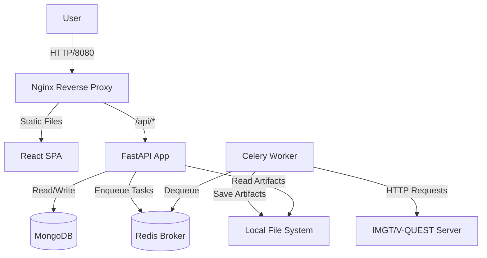

# 2. Installation & Developer Setup

This application is designed to be entirely containerized, meaning the only prerequisite for running it locally or in production is **Docker**.

## Prerequisites

- [Docker Engine](https://docs.docker.com/engine/install/) installed.
- [Docker Compose](https://docs.docker.com/compose/install/) available on your command line.

## Environment Variables

Before starting the containers, you must configure the environment variables. Copy the `.env.example` file to create a new `.env` file in the root directory.

```bash
cp .env.example .env
```

> [!IMPORTANT]
> **IMGT Credentials:** You MUST provide valid `IMGT_USER` and `IMGT_PASSWORD` variables in your `.env` file. Without these, the Celery workers will fail to authenticate with the IMGT/V-QUEST web interface.

Key variables in `.env`:
- `MONGO_URI`: The connection string for the MongoDB instance (default is `mongodb://mongo:27017/cll_genie`).
- `REDIS_URL`: The broker URL for Celery (default is `redis://redis:6379/0`).
- `DATA_DIR`: Where artifacts (PDFs, Excels) and Audit logs will be stored. Maps to a local volume.

## Building and Running

To spin up the entire stack (Frontend, FastAPI, Celery Scheduler, Celery Worker, Redis, and MongoDB):

```bash
docker compose up --build
```

> [!TIP]
> Run `docker compose up -d --build` to run the containers in the background (detached mode).

Once running, the application will be accessible at:
**`http://localhost:8080/cll_genie/`**

## Default Identities

When the application boots against an empty database, a default local user is seeded.
- **Username:** `admin`
- **Password:** `admin`

> [!WARNING]
> Please navigate to the Admin/Users panel immediately after your first login and change this password or configure proper user access!

## Architecture Diagram (Logical)



---

**[Next up: Samples & Data Upload ➔](03_samples_and_qc.md)**
