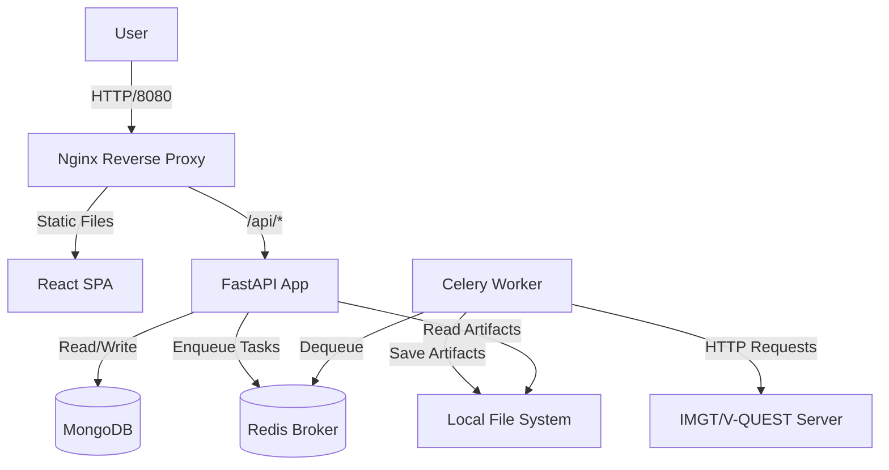

# 2. Installation & Developer Setup

This application is designed to be entirely containerized, meaning the only prerequisite for running it locally or in production is **Docker**.

## Prerequisites

- [Docker Engine](https://docs.docker.com/engine/install/) installed.
- [Docker Compose](https://docs.docker.com/compose/install/) available on your command line.

The examples below use the standalone Compose 1.29 command, `docker-compose`. With the Compose v2 plugin, use `docker compose` instead.

## Environment Variables

Before starting the containers, copy `.env.example` to `.env` in the repository root and review every value. Compose requires this file and does not provide fallback values for deployment-specific settings.

```bash
cp .env.example .env
```

### Application and Compose

| Variable | Example | Purpose |
|---|---|---|
| `APP_NAME` | `CLL Genie` | Application title exposed in API metadata. |
| `APP_VERSION` | `2.0.0` | Version reported by health, authentication, API, and generated-report metadata. |
| `ENVIRONMENT` | `development` | Runtime mode: `development`, `test`, `validation`, or `production`. Production disables the interactive API documentation and enables production logging behavior. |
| `APPLICATION_PREFIX` | `/cll_genie` | URL prefix used by health endpoints and the session cookie path. |
| `API_PREFIX` | `/cll_genie/api/v1` | URL prefix applied to the versioned API routes and API documentation. |
| `CLL_GENIE_PORT` | `8080` | Host port mapped to the Nginx proxy. The UI is served from this port. |
| `MONGO_DEV_PORT` | `27017` | Host port mapped to the optional MongoDB container enabled by the `mongo` profile. |

### Databases, collections, and Celery

| Variable | Example | Purpose |
|---|---|---|
| `MONGODB_URI` | `mongodb://mongo.example.internal:27017` | MongoDB connection URI. Set an address reachable from containers, or use `mongodb://mongo:27017` with the Compose `mongo` profile. |
| `APPLICATION_DATABASE` | `cll_genie` | MongoDB database containing users, sessions, application data, and analysis data. |
| `USERS_COLLECTION` | `users` | Application-database collection containing local user profiles, roles, and optional local password hashes. |
| `SESSIONS_COLLECTION` | `cll_genie_sessions` | Application-database collection containing active login sessions and their expiry times. |
| `SAMPLES_COLLECTION` | `samples` | Application-database collection containing registered sequencing samples and QC metadata. |
| `RESULTS_COLLECTION` | `vquest_results` | Application-database collection containing IMGT/V-QUEST submissions, results, and comments. |
| `JOBS_COLLECTION` | `analysis_jobs` | Application-database collection tracking asynchronous analysis-job status and progress. |
| `COUNTERS_COLLECTION` | `submission_counters` | Application-database collection allocating sequential submission IDs per sample. |
| `ARTIFACTS_COLLECTION` | `artifacts` | Application-database collection containing metadata for stored report and analysis files. |
| `REPORTS_COLLECTION` | `reports` | Application-database collection containing generated report records and visibility state. |
| `RULES_COLLECTION` | `report_rules` | Application-database collection containing clinical report interpretation rules. |
| `REDIS_URL` | `redis://redis:6379/0` | Redis URL used as both the Celery broker and result backend. |
| `CELERY_EAGER` | `false` | When `true`, executes Celery tasks synchronously in the calling process. Intended for tests, not normal deployments. |

### Authentication and sessions

| Variable | Example | Purpose |
|---|---|---|
| `AUTH_PROVIDERS` | `ldap,local` | Comma-separated enabled login providers. Supported values are `ldap` and `local`; Organization/LDAP is presented first when configured. |
| `SESSION_COOKIE_NAME` | `cll_genie_session` | Name of the browser cookie containing the session token. |
| `SESSION_TTL_SECONDS` | `28800` | Session lifetime in seconds; `28800` is eight hours. |
| `COOKIE_SECURE` | `false` | Set to `true` when the application is served over HTTPS so browsers only send the session cookie over secure connections. |
| `COOKIE_SAMESITE` | `lax` | Browser SameSite policy for the session cookie. Supported values are `lax` and `strict`. |

### LDAP

LDAP settings are used only when `ldap` is present in `AUTH_PROVIDERS`.

| Variable | Example | Purpose |
|---|---|---|
| `LDAP_HOST` | `ldap://ldap.example.internal` | LDAP server URI. Use `ldap://` with STARTTLS or `ldaps://` with SSL. |
| `LDAP_BASE_DN` | `dc=example,dc=internal` | Directory base DN. It is combined with `LDAP_USER_DN` for user searches. |
| `LDAP_USER_LOGIN_ATTR` | `mail` | LDAP attribute matched against the login identifier. With `mail`, CLL Genie uses the email stored in the local user record. |
| `LDAP_USE_SSL` | `false` | Enables implicit TLS (LDAPS). When `true`, use an `ldaps://` host and set `LDAP_USE_TLS=false`. |
| `LDAP_USE_TLS` | `true` | Enables STARTTLS before binding. When `true`, use an `ldap://` host and set `LDAP_USE_SSL=false`. |
| `LDAP_BINDDN` | `cn=service-account,dc=example,dc=internal` | Service-account distinguished name used to search for users. |
| `LDAP_SECRET` | `replace-me` | Service-account password. Replace this value and never commit the populated `.env` file. |
| `LDAP_USER_DN` | `ou=people` | User subtree relative to `LDAP_BASE_DN`; the example searches `ou=people,dc=example,dc=internal`. |
| `LDAP_CONNECT_TIMEOUT_SECONDS` | `5` | Connection and response timeout for LDAP operations, in seconds. |

LDAP authentication does not automatically provision application users. The submitted email must match an enabled record in `USERS_COLLECTION` by `email`. Local login accepts the record's `username`. CLL Genie then binds with `LDAP_BINDDN`, searches `LDAP_USER_DN,LDAP_BASE_DN` using `LDAP_USER_LOGIN_ATTR`, and verifies the password by binding as the single matching directory entry. STARTTLS and LDAPS server certificates are validated against the container's system trust store.

### Filesystem and ingestion

The four root paths are bind-mounted at the same absolute paths inside the containers. `LYMPHOTRACK_RESULTS_ROOT` must be readable by container UID/GID `10001`; `LOG_ROOT`, `ARTIFACT_ROOT`, and `RUN_ROOT` must exist and be writable by that UID/GID before startup.

Create writable output directories before starting Compose, substituting the paths configured in `.env`:

```bash
sudo install -d -o 10001 -g 10001 /data/cll-genie/logs /data/cll-genie/artifacts
```

| Variable | Example | Purpose |
|---|---|---|
| `LOG_ROOT` | `/data/cll-genie/logs` | Root directory for application and audit logs. The API writes `app.log` here. |
| `ARTIFACT_ROOT` | `/data/cll-genie/artifacts` | Root directory for generated reports and downloaded analysis artifacts. |
| `LYMPHOTRACK_RESULTS_ROOT` | `/data/lymphotrack/results/lymphotrack_dx` | Root directory recursively scanned for LymphoTrack Excel and QC result files. |
| `RUN_ROOT` | `/data/MiSeq` | Root directory scanned by the scheduler for completed sequencing runs. |
| `RUN_RTA_MARKER` | `RTAComplete.txt` | Filename that indicates sequencing run completion. A run is ingested only when this and the pipeline marker exist. |
| `RUN_PIPELINE_MARKER` | `cdm.done` | Filename that indicates upstream pipeline completion. |
| `RUN_CLL_GENIE_MARKER` | `cll_genie.done` | Filename created after CLL Genie ingests a run, preventing duplicate ingestion. `RUN_ROOT` therefore requires write access. |

### External service, API, and reporting behavior

| Variable | Example | Purpose |
|---|---|---|
| `IMGT_VQUEST_URL` | `https://www.imgt.org/IMGT_vquest/analysis` | IMGT/V-QUEST endpoint used for sequence analysis submissions. |
| `IMGT_CONNECT_TIMEOUT_SECONDS` | `5` | HTTP connection timeout for IMGT/V-QUEST, in seconds. |
| `IMGT_READ_TIMEOUT_SECONDS` | `180` | HTTP response timeout for IMGT/V-QUEST analysis, in seconds. |
| `PAGE_SIZE_MAX` | `100` | Maximum number of samples accepted in one paginated API response. |
| `MUTATION_BORDERLINE_LOWER` | `97.0` | Lower V-region identity percentage used for the borderline mutation classification. |
| `MUTATION_BORDERLINE_UPPER` | `97.99` | Upper V-region identity percentage used for the borderline mutation classification. |
| `PDF_ANALYSIS_RUN_AT` | `SMD, Molecular Diagnostics` | Laboratory or unit name printed in the “analysis performed by” field of generated PDF reports. |

## Building and Running

To start the frontend proxy, FastAPI, Celery scheduler, Celery worker, and Redis against the configured MongoDB:

```bash
docker-compose up --build
```

To also start the optional MongoDB container, first set `MONGODB_URI=mongodb://mongo:27017` in `.env`, then run:

```bash
docker-compose --profile mongo up --build
```

> [!TIP]
> Run `docker-compose up -d --build` to run the containers in the background (detached mode).

Once running, the application will be accessible at:
**`http://localhost:8080/cll_genie/`**

## Initial User

CLL Genie does not create a default account. Before the first login, create or import at least one enabled user with an `admin` or `lymphotrack_admin` role in `APPLICATION_DATABASE.USERS_COLLECTION`. See [User Management](09_user_management.md#user-document-schema) for the document schema. LDAP authenticates the password but does not create the local authorization record.

## Architecture Diagram (Logical)



---

**[Next up: Samples & Data Upload ➔](03_samples_and_qc.md)**
